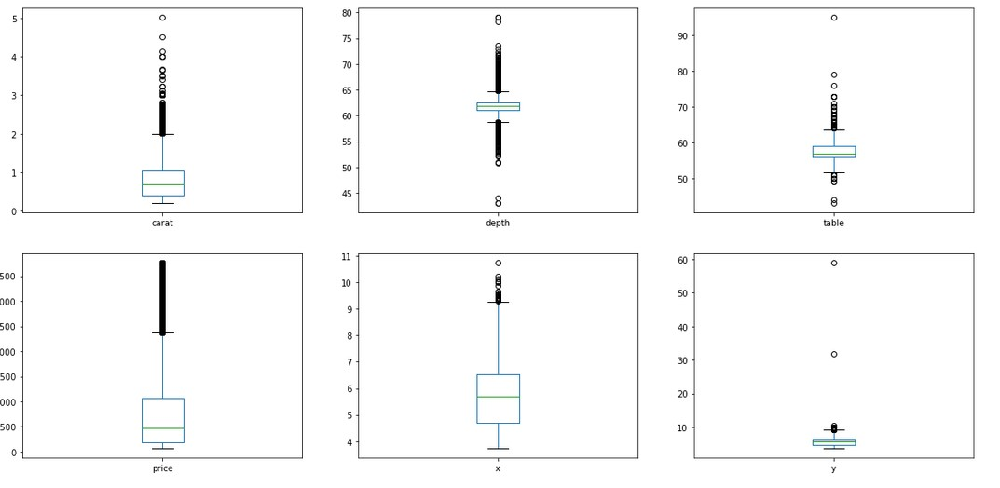
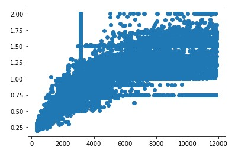
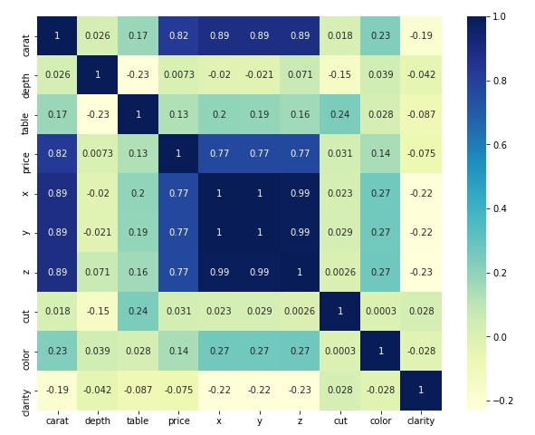
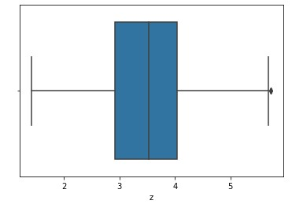

<h1 align="center">Get Rich with Diamonds :diamonds:</h1>

# [DEMO](https://youtu.be/GeMvT9ClAf4)

|||| 
|---|---|---|
|||
|---|---|

## Purpose of the project :
Have you ever asked yourself, how are diamonds priced? Well, this article talks about the diamonds price prediction based on their cut, colour, clarity & other attributes and it also covers the building a simple linear regression model.

Diamond prices can vary hugely depending on a diamond’s shape, cut quality, clarity and color. For example, the cost of a one carat diamond can range from just $1,500 to more than $16,000 for an extremely well cut, high quality diamond, while a two carat diamond could cost as little as $6,000 or as much as $80,000 based on its shape, cut, clarity and color grades.

As you can see, this is a huge range, with some diamonds costing as much as 10 times higher than other diamonds of the same carat weight.

Diamond prices depend on such a wide range of factors that’s very difficult to give an accurate price estimate for “diamonds” as a whole. The biggest of these are the four Cs, which we briefly mentioned earlier — cut quality, clarity, color and carat weight. 

## Prerequisites :

Jupyter NoteBook/Kaggle Notebook, A Diamond Price Dataset(I have considered the classic Diamonds dataset which contains the prices and other attributes of almost 54,000 diamonds and this dataset is hosted on Kaggle. The dataset contains 53940 rows and 10 variables. Before jumping into building the model, let’s have a look into the variables & their definitions.), GPU (Recommended)

## Setup :
Install all the required modules with pip installer:

import numpy as np

import pandas as pd 

import matplotlib.pyplot as plt

import seaborn as sns 

from sklearn.preprocessing import LabelEncoder

import statsmodels.api as st

from statsmodels.stats.outliers_influence import variance_inflation_factor

from sklearn.model_selection import train_test_split

from sklearn.linear_model import LinearRegression

from sklearn.metrics import r2_score,mean_squared_error

from sklearn.ensemble import RandomForestRegressor

## Working of this Python project is as follows :

1: Load the dataset

2: Perform the exploratory data analysis (EDA)

3: Prepare the dataset for training

4: Create a linear regression model

5: Train the model to fit the data

6: Make predictions using the trained model 

7: Create Random forest regressor 

8: Perform hyperparamater tuning

9: Make predictions and calculate accuracy

## Contributors :sparkles:
<!-- readme: contributors -start --> 
<table>
<tr>
    <td align="center">
        <a href="https://github.com/atharwa-24">
            
             
            <b>Atharwa_24</b>
        </a>
    </td>
    <td align="center">
        <a href="https://github.com/suhas-kadu">
            
             
            <b>Suhas Kadu</b>
        </a>
    </td>    
    <td align="center">
        <a href="https://github.com/Viraj-Kadlag05">
            
             
            <b>Viraj Kadlag</b>
        </a>
    </td></tr>
</table>
